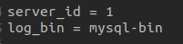
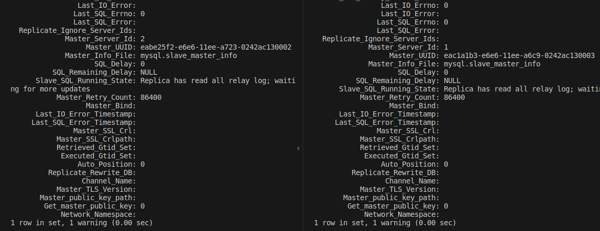

# Домашнее задание к занятию  
# «Репликация и масштабирование. Часть 1» - `Шорохов Вячеслав SDBSQL-27`

---

### Задание 1. 

На лекции рассматривались режимы репликации master-slave, master-master, опишите их различия.
#### Решение:
При master-slave репликации все изменения в данных, добавление, обновление, удаление, происходят на мастер сервере после чего слейв сервер копирует их себе, эта конфигурация позволяет резервировать данные и распределять нагрузку так как слейв сервер доступен для чтения данных. 
При master-master репликации каждый сервер является мастером и слейвом  одновременно, эта конфигурация добавляет избыточность и повышает эффективность при обращении к данным.

---

### Задание 2. 

Выполните конфигурацию master-slave репликации, примером можно пользоваться из лекции.
#### Решение:

Через docker-compose поднимаем тестовую среду из двух контейнеров mysql:
```
docker-compose -f "m-s.yml" up -d --build
```

`Dockerfile master-slave:`


Внесение изменений на сервер master в mysql:
```
CREATE USER 'rep'@'%' IDENTIFIED WITH mysql_native_password BY 'slaverep';
GRANT REPLICATION SLAVE ON *.* TO 'rep'@'%';

SHOW MASTER STATUS;
```

Внесение изменений на сервер slave в mysql, lof_file и lof_pos берем из вывода show master status:
```
CHANGE MASTER TO
MASTER_HOST='mysql-master',
MASTER_USER='rep',
MASTER_PASSWORD='slaverep',
MASTER_LOG_FILE='mysql-bin.000003',
MASTER_LOG_POS=658;

START SLAVE;

SHOW SLAVE STATUS\G
```

`Добавленные строки в my.cnf на мастере:`

`Добавленные строки в my.cnf на слейве:`


`SHOW MASTER STATUS:`


`SHOW SLAVE STATUS\G:`


`Проводим тест, создаем новую базу данных на мастере, проверяем, появилась ли она на слейве, всё успешно:`


---

### Задание 3. 

Выполните конфигурацию master-master репликации. Произведите проверку.
#### Решение:

Через docker-compose поднимаем тестовую среду из двух контейнеров mysql:
```
docker-compose -f "m-m.yml" up -d --build
```

`Dockerfile master-slave:`


Внесение изменений на сервер master-1 в mysql, lof_file и lof_pos берем из вывода show master status на master-2:
```
CREATE USER 'rep'@'%' IDENTIFIED BY 'pass';
GRANT REPLICATION SLAVE ON *.* TO 'rep'@'%';

SHOW MASTER STATUS;

CHANGE MASTER TO
MASTER_HOST='master-2',
MASTER_USER='rep',
MASTER_PASSWORD='pass',
MASTER_LOG_FILE='mysql-bin.000003',
MASTER_LOG_POS=658;

START SLAVE;
```

Внесение изменений на сервер master-2 в mysql, lof_file и lof_pos берем из вывода show master status на master-1:
```
CREATE USER 'rep'@'%' IDENTIFIED BY 'pass';
GRANT REPLICATION SLAVE ON *.* TO 'rep'@'%';

SHOW MASTER STATUS;

CHANGE MASTER TO
MASTER_HOST='master-1',
MASTER_USER='rep',
MASTER_PASSWORD='pass',
MASTER_LOG_FILE='mysql-bin.000003',
MASTER_LOG_POS=658;

START SLAVE;
```

`Добавленные строки в my.cnf на мастере1:`

`Добавленные строки в my.cnf на мастере2:`


`SHOW MASTER STATUS, SHOW SLAVE STATUS:`



`Проводим тест, создаем новую базу данных test1 на мастере1 и создаем новую базу данных test2 на мастере2, проверяем, появилась ли они на обеих серверах, всё успешно:`


---
